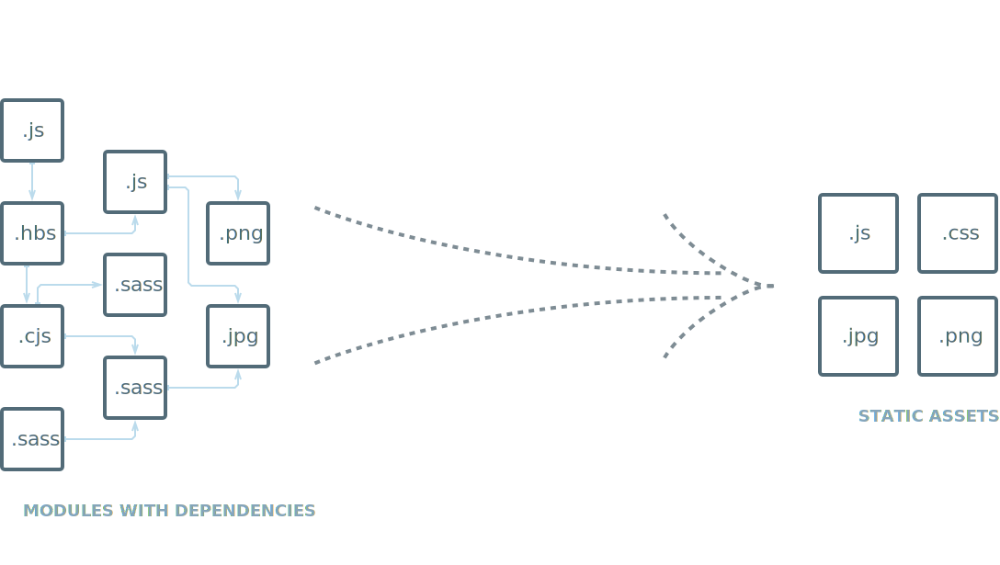

# Webpack

---

# Principes

---

    
        

            

            

            

            

            

            

        

        

            

            

            

            

            

            

        

    

---

# 

# Contexte

Problème: Comment 

---
# Solution

Croyance ? 
Boite noire
Trop compliqué
Rapport avec la config ?

