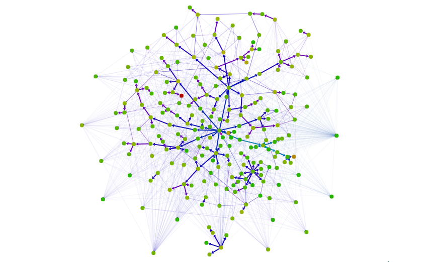
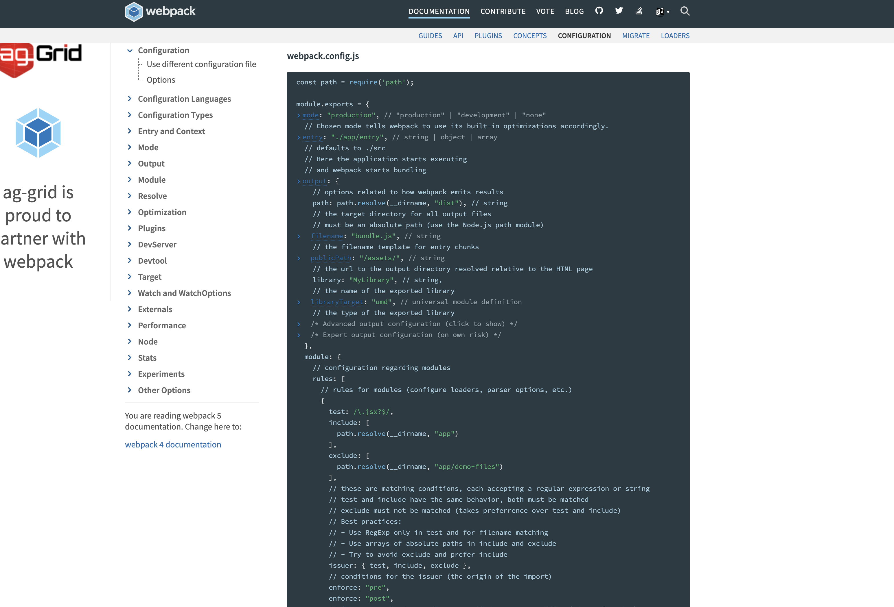

# Webpack

---

## Problème

    
        

            

            

            

            

            

            

        

        

            

            

            

            

            

            

        

    

<blockquote class="fragment" data-fragment-index="3">
Rassembler le code, les assets et les dépendances en un livrable déployable.
</blockquote>

----

## Graphe de dépendances

---

## Configuration

La doc sur [webpack.js.org/configuration](https://webpack.js.org/configuration/) on a :

----

En résumé

<pre><code data-trim data-line-numbers="|3|4-8|9-11|26">
module.exports = {
  mode: "production",
  entry: "./app/entry",
  output: {
    path: path.resolve(__dirname, "dist"),
    filename: "bundle.js", // string
    publicPath: "/assets/",
  },
  module: {
    rules: [/*...*/],
  },
  resolve: {
    modules: ["node_modules"],
    extensions: [".js", ".json", ".jsx", ".css"],
    alias: {
      "module": path.resolve(__dirname, "app/third/module.js"),
    },
  },
  performance: {},
  devtool: "source-map",
  context: __dirname,
  target: "web",
  externals: ["react", /^@angular/],
  stats: "errors-only",
  devServer: {},
  plugins: [],
};
</code></pre>

---

## Ouvrons la boite noire

---

## entry

> Le point d'entrée du graph de dépendances

<pre><code data-trim data-line-numbers="2">
module.exports = {
  entry: "./app/entry",  // string | object | array
  output: {
    path: path.resolve(__dirname, "dist"),
    filename: "bundle.js",
    publicPath: "/assets/",
  },
  module: {
    rules: [/*...*/],
  },
  plugins: [],
};
</code></pre>

Tout cela avec le mot clé <code>import</code>

---

## module

> Configure les règles de traitement des modules

<pre><code data-trim data-line-numbers="8-15">
module.exports = {
  entry: "./app/entry",
  output: {
    path: path.resolve(__dirname, "dist"),
    filename: "bundle.js",
    publicPath: "/assets/",
  },
  module: {
    rules: [
      {
          test: /\.(js|jsx)$/,
          use: ['babel-loader'],
      },
    ],
  },
  plugins: [],
};
</code></pre>

----

## loader

> Appliquent des transformations au code source d'un module.

<pre class="fragment" data-fragment-index="2"><code data-trim data-line-numbers="|5|6|7|">
module.exports = {
  module: {
    rules: [
      {
          test: /\.(js|jsx)$/, // match un module
          use: ['babel-loader'], // définis le loader utilisé
          include: ['/app/components'], // Optionel : répertoire du module
      },
    ],
  },
};
</code></pre>

----

## Exemple scss

<pre><code data-trim data-line-numbers="4-12">
module.exports = {
  module: {
    rules: [
      {
        test: /\.scss$/,
        use: [
          MiniCssExtractPlugin.loader,
          'css-loader',
          'postcss-loader',
          'sass-loader',
        ],
      },
    ],
  },
};
</code></pre>

 

⚠️ L'ordre est inversé ⚠️ <!-- .element: class="fragment" data-fragment-index="2" -->

---

## plugins

> Permettent des opérations plus variées que les loaders en se branchant au cycle de vie du build.

<pre><code data-trim data-line-numbers="1-3|15-30">
const HtmlWebpackPlugin = require('html-webpack-plugin'); // installed via npm
const CopyWebpackPlugin = require('copy-webpack-plugin'); // installed via npm
const webpack = require('webpack'); // to access built-in plugins

module.exports = {
  entry: "./app/entry",
  output: {
    path: path.resolve(__dirname, "dist"),
    filename: "bundle.js",
    publicPath: "/assets/",
  },
  module: {
    rules: [/*...*/],
  },
  plugins: [
    new HtmlWebpackPlugin({
        template: path.join(paths.appSrc, 'views', 'index.html'),
        filename: path.join(paths.outputServer, 'views', 'index.html'),
    }),
    new webpack.DefinePlugin({
      VERSION: JSON.stringify('5fa3b9'),
    });
    new CopyWebpackPlugin([
        {
            context: path.join(paths.appSrc, 'views'),
            from: '**/*',
            to: path.join(paths.outputServer, 'views'),
        },
    ]),
  ],
};
</code></pre>

----

- Injection du bundle dans un template html : [HtmlWebpackPlugin](https://webpack.js.org/plugins/html-webpack-plugin/)
- Copie de fichiers : [CopyWebpackPlugin](https://webpack.js.org/plugins/copy-webpack-plugin/)
- Injection de variable d'env : [DefinePlugin](https://webpack.js.org/plugins/define-plugin/)
- Chunks sur les imports dynamiques : [SplitChunksPlugin](https://webpack.js.org/plugins/split-chunks-plugin/)
- Import de css dans les composants : [MiniCssExtractPlugin](https://webpack.js.org/plugins/mini-css-extract-plugin/)

Peuvent/doivent être utilisés en conjonction avec leur loader <!-- .element: class="fragment" data-fragment-index="1" -->

----

## Exemple: MiniCssExtractPlugin

<pre><code data-trim>
const MiniCssExtractPlugin = require('mini-css-extract-plugin');

module.exports = {
  plugins: [
    new MiniCssExtractPlugin({
      // Options similar to the same options in webpackOptions.output
      // both options are optional
      filename: '[name].css',
      chunkFilename: '[id].css',
    }),
  ],
  module: {
    rules: [
      {
        test: /\.css$/,
        use: [
          {
            loader: MiniCssExtractPlugin.loader,
            options: {
              publicPath: '/public/path/to/',
            },
          },
          'css-loader',
        ],
      },
    ],
  },
};
</code></pre>

---

## output

> Définis les chemins de sortie des résultats

<pre><code data-trim data-line-numbers="3-7|4|5|6">
module.exports = {
  entry: "./app/entry",
  output: {
    path: '/dist', // chemin physique dans le dossier de destination
    filename: "bundle-[name]-[chunkhash].js", // nom des fichiers de sortie
    publicPath: "/assets", // url vers le dossier final relatif a la page HTML
  },
  module: {
    rules: [/*...*/],
  },
  plugins: [],
};
</code></pre>

⚠️publicPath doit contenir l'url du CDN si besoin

---
# Sources

La doc : [https://webpack.js.org/concepts/](https://webpack.js.org/concepts/)

---

# Merci

<iframe width="560" height="315" data-src="https://www.youtube.com/embed/dhpsfwjzSH8?autoplay=1&controls=0" frameborder="0" allow="accelerometer; autoplay; encrypted-media; gyroscope; picture-in-picture" allowfullscreen></iframe>
